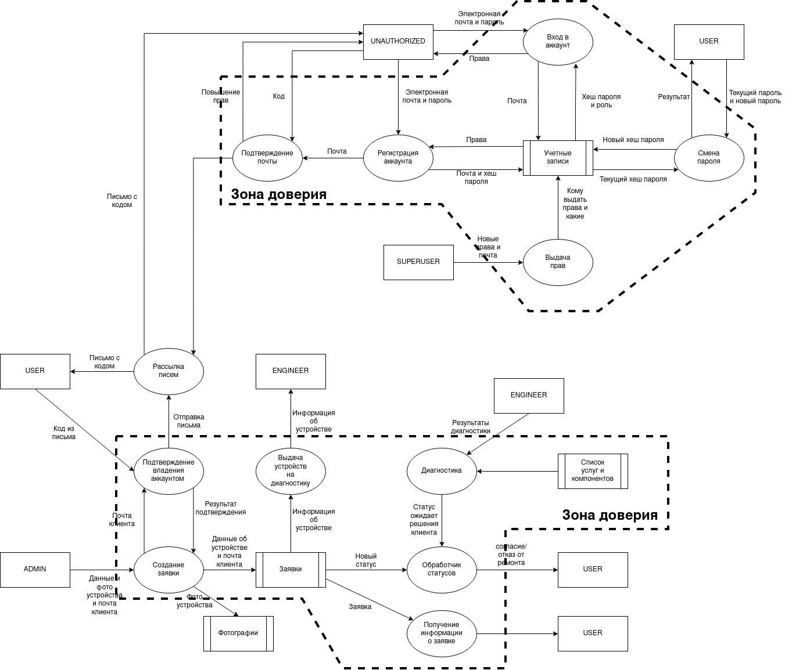

# Модель угроз

## Угрозы

| Угроза | Приоритет |
|---|---|
| [T-01](threats/T-01.md) | High |
| [T-02](threats/T-02.md) | High |
| [T-03](threats/T-03.md) | High |
| [T-04](threats/T-04.md) | High |
| [T-05](threats/T-05.md) | High |
| [T-06](threats/T-06.md) | Medium |
| [T-07](threats/T-07.md) | High |
| [T-08](threats/T-08.md) | High |
| [T-09](threats/T-09.md) | High |
| [T-10](threats/T-10.md) | Medium |

## Архитектура

[Исходник диаграммы](architecture/diagram.drawio)

### Границы доверия

На диаграмме пунктирными линиями отмечены доверенные зоны серверной части продукта.

- Верхняя зона отвечает за работу с учётными записями: регистрацию, подтверждение почты, вход, смену пароля и выдачу прав.
- Нижняя зона отвечает за работу с заявками: создание заявки, диагностику, изменение статусов и получение информации о ремонте.

Пользователи `UNAUTHORIZED`, `USER`, `ADMIN`, `ENGINEER` и `SUPERUSER` находятся за пределами доверенных зон. Даже после входа данные из браузера не считаются доверенными: сервер проверяет сессию, роль пользователя, принадлежность заявки и допустимость операции.

Все данные, пересекающие пунктирную границу, проходят серверную проверку. Пароли не сохраняются в открытом виде: в хранилище учётных записей передаётся только хеш пароля. Внешние сервисы и хранилища также не входят в доверенную зону приложения, поэтому их ответы и доступность проверяются отдельно.
